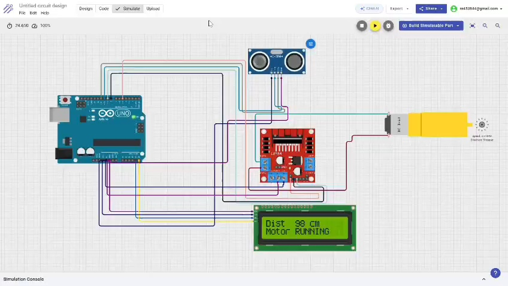

# 🚗 Task 2: Motor Control with PWM & Obstacle Detection

* **Internship:** Embedded Systems Internship at Alfido Tech  
* **Name:** ANISH KUMAR  
* **Candidate ID:** BS/REG/122708

---

## 🎯 Project Overview

This project demonstrates the speed control of a DC motor using Pulse Width Modulation (PWM) and an automatic braking system using an HC-SR04 ultrasonic sensor. The system continuously monitors the distance of objects in front of it and displays the real-time status on a 16×2 I2C LCD. If an obstacle is detected within a safe threshold, the motor stops automatically.

---

## 🛠 Hardware Components

* **Microcontroller:** Arduino Uno R3
* **Motor Driver:** L298N Module
* **Sensor:** HC-SR04 Ultrasonic Sensor
* **Display:** 16×2 LCD Display with I2C Backpack
* **Actuator:** DC Gear Motor
* **Power Supply:** External Battery/Power Source for L298N

---

## 📸 Circuit Diagram


## 🔌 Pin Mapping

| Component | Pin Name | Arduino Pin |
| :--- | :--- | :--- |
| **HC-SR04** | Trig | D10 |
| | Echo | D11 |
| **L298N** | ENA (PWM) | D5 |
| | IN1 | D6 |
| | IN2 | D7 |
| **I2C LCD** | SDA | A4 (SDA) |
| | SCL | A5 (SCL) |

---

## ⚙️ How It Works (Logic)

1. The **HC-SR04** sensor triggers a pulse and calculates the distance of any object in front of it.
2. The distance is continuously printed on the Serial Monitor and the I2C LCD.
3. **Condition 1 (Safe Zone):** If the distance is **greater than 20 cm**, the Arduino sends a PWM signal of 150 to the L298N driver. The motor runs smoothly, and the LCD displays `"Motor RUNNING"`.
4. **Condition 2 (Obstacle Detected):** If the distance is **less than or equal to 20 cm**, the PWM signal is immediately dropped to 0. The motor stops to prevent a collision, and the LCD displays `"Motor STOP"`.

[▶ Watch Demo Video](Task2_video.mp4)

## Arduino Source Code
```cpp
#include <Wire.h>
#include <LiquidCrystal_I2C.h>

// LCD address 0x27, 16 columns and 2 rows
LiquidCrystal_I2C lcd(0x27, 16, 2);

// Ultrasonic sensor pins
const int trigPin = 10;
const int echoPin = 11;

// Motor driver pins
const int ENA = 5;    // PWM pin
const int IN1 = 6;
const int IN2 = 7;

long duration;
int distance;

void setup()
{
  // Ultrasonic pins
  pinMode(trigPin, OUTPUT);
  pinMode(echoPin, INPUT);

  // Motor pins
  pinMode(ENA, OUTPUT);
  pinMode(IN1, OUTPUT);
  pinMode(IN2, OUTPUT);

  // Serial Monitor
  Serial.begin(9600);

  // LCD setup
  lcd.init();
  lcd.backlight();

  lcd.setCursor(0, 0);
  lcd.print("DC Motor Control");
  delay(2000);
  lcd.clear();

  // Motor direction forward
  digitalWrite(IN1, HIGH);
  digitalWrite(IN2, LOW);
}

void loop()
{
  // Trigger ultrasonic pulse
  digitalWrite(trigPin, LOW);
  delayMicroseconds(2);

  digitalWrite(trigPin, HIGH);
  delayMicroseconds(10);
  digitalWrite(trigPin, LOW);

  // Read echo with timeout
  duration = pulseIn(echoPin, HIGH, 30000);

  // Calculate distance
  if (duration == 0)
  {
    distance = 400; // No object detected / Out of range
  }
  else
  {
    distance = duration * 0.034 / 2;
  }

  // Serial Monitor Output
  Serial.print("Distance = ");
  Serial.print(distance);
  Serial.println(" cm");

  // LCD display
  lcd.clear();
  lcd.setCursor(0, 0);
  lcd.print("Dist: ");
  lcd.print(distance);
  lcd.print(" cm");

  // Obstacle detection logic
  if (distance <= 20)
  {
    analogWrite(ENA, 0); // Stop motor
    lcd.setCursor(0, 1);
    lcd.print("Motor STOP");
  }
  else
  {
    analogWrite(ENA, 150); // Motor running at medium speed
    lcd.setCursor(0, 1);
    lcd.print("Motor RUNNING");
  }

  delay(200);
}
